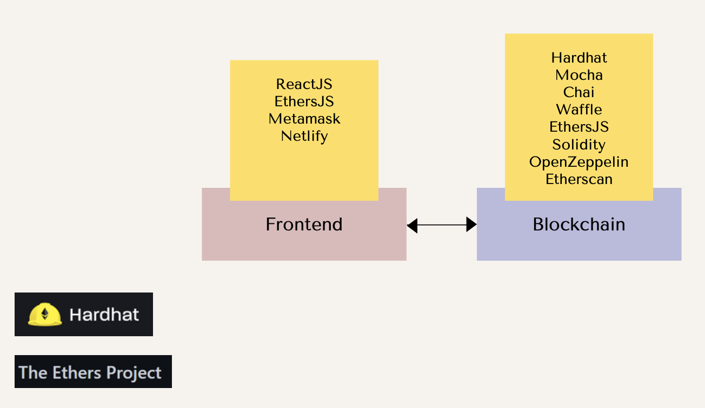
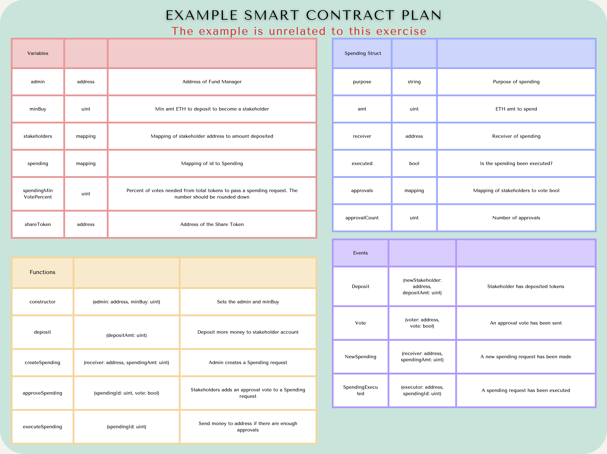

# Submission Notes
URL (Could not use Netlify due to KYC requirement): https://auction-house-plausibly.vercel.app/

Auction House: https://sepolia.etherscan.io/address/0x63D7245276Fb3162fbD2089B40CF6681721111ec

Auction House Coin (AUC): https://sepolia.etherscan.io/address/0xD4Ab997ecf012387bCCA44D5fCC8bd49614B59B4

# Contract Plan

 Click to expand smart contract plan 

| Variables | |  |  
| -------- | -------- | -------- |  
| admin | address | The address for the house admin|  
| lock | bool | Locking variable to prevent re-entrancy attacks|
| feeBp | uint | The fee to charge on succesful sales. Represented in basis points |
| collectedFees | uint256 | The total collected fees available for withdrawal by managers |
| auctionId | uint256 | Incremental variable used to generate new IDs for each auction created|
| coin | address | The address of the ERC-20 contract for AUC |
| managers | mapping | Maps an address to a boolean, indicating whether they are a manager. |
| auctions | mapping | Maps an auction id to the auction item struct |

###

| Auction Item Struct |  |  |  
| --- | --------- | ------------ |  
| seller | address | The address of the seller |  
| contractId | address | The ERC-721 contract address of the item being sold |
| tokenId | uint256 | The specific token id (within the ERC-721 contract) of the item being sold|
| endTime | uint256 | The end time of the auction, specified in epoch seconds |
| highestBid | uint256 | The bidding amount. If there is no bidder, the starting price |
| highestBidder | address | The highest bidder, or 0x0 for no bids|
| archived | bool | Whether or not the auction has ended and items were claimed |

###

| Functions |  |  |  
| -------- | -------- | -------- |  
| constructor | (admin: address, fee: uint, AuctionHouseCoin: coin) | Creates an auction house object with the specified values. Sets default admin address, fee and AUC contract |  
| claimItems | (id: uint256) | Trigger an item claim for an auction. Item/AUC sent to respective buyer/seller |
| createAuction | (contractAddress: address, tokenId: uint256, startPrice: uint256, endTime: uint256) | Allows a seller to create an auction for an ERC-721 token |
| lowerPrice | (id: uint256, newPrice: uint256) | Allows the seller to lower an auction price if no bids have been placed yet |
| forceEndAuction | (id: uint256) | Allows the seller to end an auction, completes any potential sales |
| cancelAuction | (id: uint256) | Allows the seller to cancel an auction, refunds items to everyone |
| placeBid | (id: uint256, bidAmnt: uint256) | Place a bid on an auction item, replacing the old bid (if it is a valid bid) |
| setAdmin | (newAdmin: address) | Allows the administrator to replace the admin address |
| addManager | (addr: address)| Allows the administrator to add an address to management |
| removeManager | (addr: address) | Allows the administrator to remove an address from management |
| withdrawFees | (amnt: uint256) | Allows management/admins to withdraw collected fees into the admin address|
| setFee | (fee: uint) | Allows management/admin to update the house fee |
| calculateHouseCut | (amnt: uint256) | Applies the house fee to the provided amount and returns the computed value |

###
| Events | | |  
| -------- | -------- | -------- |  
| AuctionCreated | (id: uint256) | Indicates that a new auction has been created, with the ID mapped to the auction struct |  
| AuctionCancelled | (id: uint256) | Indicates that an auction was cancelled (refunded items) by the seller |
| AuctionEnded | (id: uint256) | Indicates that an auction was ended (items sold to bidder) by the seller |
| BidPlaced | (id: uint256, newBid: uint256) | Indicates a new bid being placed on a specific auction, with the bid amount |
| ItemClaimed | (id: uint256) | Indicates that items were claimed for an auction that had ended by time |
| FeeChanged | (fee: uint) | Indicates that the fee has changed for auction sales  |
| PriceLowered | (id: uint256, newPrice: uint256) | Indicates the starting price has decreased by the seller for an item |

# Auction House Dapp

This dApp allows users to participate in [English Auctions](https://en.wikipedia.org/wiki/English_auction).

A seller can:

- **auction digital item (ERC721)**: sends item to auction house with starting price in Auction House Coin (ERC20) with symbol AUC, and auction end time. Users can create a new digital item or send an existing one. To keep it simple, AUC can be minted by anyone.
- **cancel auction**: bids no longer allowed, item returns to seller. Cannot cancel after auction end time.
- **end auction**: item sent to highest bidder, AUC sent to seller. Auctions can be ended before time runs out.
- **lower starting price**: starting price is lowered.

A buyer can:

- **place bid**: sends AUC to auction house for an auction. If the auction is not new, and is higher bid than the previous, send the AUC of the old bid back to the old bidder. Cannot place bid after auction has ended.
- **claim item**: item sent to highest bidder, AUC sent to seller. Claim can occur only after auction ends.

An admin can:

- **set fee**: set a fee (default 2.5%) for all successful auctions. Fees are sent to the auction contract
- **change admin**: change the admin address
- **withdraw fees**: withdraw fees collected to admin address
- **add/remove managers**: add/remove managers, who can set fess and withdraw fees to admin address

## Criteria

1. The dApp includes a frontend to show all necessary data for users to participate in Auctions and the smart contracts that facilitates the underlying logic and data storage.
2. The smart contracts must be developed using the Tech Stack specified in the later slides.
3. The Solidity code must be fully documented following [Natspec](https://docs.soliditylang.org/en/latest/natspec-format.html). 
4. The smart contracts must be tested with written test cases with clear documentation. Make sure there are no security flaws and code is gas optimized.
5. The Smart Contracts should be deployed on Sepolia network and verified on Sepolia [Etherscan](https://sepolia.etherscan.io/). Use this [Hardhat plugin](https://hardhat.org/hardhat-runner/plugins/nomicfoundation-hardhat-verify) to verify. The Etherscan links to the contracts should be added to the ReadMe.
6. The frontend code should be Web3 focused and is an organized UI. Take design inspiration from [Opensea](https://opensea.io/).
7. The website should be deployed to [Netlify](https://docs.netlify.com/get-started/). The URL should be in the ReadMe. 
8. The code should be uploaded to your course repository and should include two folders: `frontend` and `contracts`.
9. A smart contract plan should be uploaded to the repo. See the example at the end of this README file. 

## Tech Stack 

Frontend:

- [ReactJS](https://reactjs.org/docs/getting-started.html): Frontend library to building Single Page Applications 
- [EtherJS](https://docs.ethers.io/): JS library used for integrating with EVM
- [Metamask](https://docs.metamask.io/guide/): A decentralized wallet used for interacting with ETH dApps. It also injects a free Infura Web3 Provider to interact with the blockchain
- [Netlify](https://docs.netlify.com/get-started/): Platform to host website

Blockchain: 

- [Hardhat](https://hardhat.org/hardhat-runner/docs/getting-started#overview): Framework for developing, testing and deploying Smart Contracts. Uses Mocha, Chai and Waffle
- [Mocha](https://mochajs.org/): helps document and organize tests with "describe", "it", etc
- [Chai](https://www.chaijs.com/): assertion library for testing with "expect", "assert", etc 
- [Waffle](https://getwaffle.io/): tools for compiling, deploying and testing smart contracts. It also provides extra Chai methods and can be added as an extension of Mocha
- [EthersJS](https://docs.ethers.io/): JS library used for integrating with EVM
- [Solidity](https://docs.soliditylang.org/): Language used to build smart contracts
- [OpenZeppelin Contracts](https://docs.openzeppelin.com/contracts): a library of well tested smart contracts, including ERC721
- [Etherscan](https://etherscan.io/): Block explorer
- [NFT Storage](https://nft.storage/) Decentralized file storage

## Fund Management Example

> **Important:** This Fund Management example is **not related to this assignment**. It is meant to show you an example of contract specification. Your job is to create similar specifications for your Auction House dApp. 

The Fund Management dApp allows people to deposit ETH into decentralized fund, and in return the fund will issue ERC20 tokens to represent the fund's shares. In other words, people can buy ERC20 tokens from the fund. The price is 1 FMD = 0.1ETH. The minimum ETH to spend to become a stakeholder is 0.1ETH.

The fund manager (admin) can create new spending requests in benefit of the fund, such as paying for building new software or hiring new employees. The stakeholders can then vote on such proposals. If the minimum approval votes (75% of all tokens) have been met, the admin can execute the spending, which send the ETH to a given address.

Here is the contract specification example:

